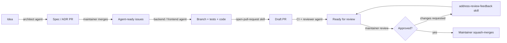

# Development workflow

hashplace is built entirely by AI agents. The maintainer (@nem0z) owns every decision and every
merge. This document describes how work moves from an idea to `main`.

## Roles

| Who              | Does                                                            | Never does                     |
|------------------|-----------------------------------------------------------------|--------------------------------|
| Maintainer       | Prioritizes, decides, reviews, resolves threads, merges         | -                              |
| `architect`      | Specs, ADRs, splits work into agent-ready issues                | Product code                   |
| `backend`        | Implements `backend/` issues, test-first                        | Merges, touches `web/`         |
| `frontend`       | Implements `web/` issues                                        | Merges, touches `backend/`     |
| `reviewer`       | Pre-reviews PRs and posts one summary review                    | Edits code, approves, merges   |

## 1. From idea to issues

1. The maintainer opens a **Design** issue (template) or just describes the idea to the
   `architect` agent.
2. The architect asks questions, then opens a docs PR that changes `docs/spec/` and/or adds an ADR.
3. When the maintainer merges it, the architect creates **agent-ready** issues: one per PR-sized
   step, with acceptance criteria, scope and dependencies.

## 2. From issue to PR

1. Start an agent on an issue, either:
   - **Locally in the Copilot app or CLI**: open a session on the issue and select the `backend`
     or `frontend` agent, or
   - **In the cloud**: assign the issue to Copilot. `copilot-setup-steps.yml` preinstalls Go,
     Node and golangci-lint.
2. The agent branches (`<type>/<issue>-<slug>`), writes tests first, implements, and runs all checks.
3. The agent opens a **draft** PR with the `open-pull-request` skill, waits for CI, runs the
   `reviewer` agent, fixes the findings and marks the PR ready.

## 3. Review and merge

1. The maintainer reviews on GitHub, leaving inline comments and a "Request changes" or
   "Comment" review.
2. The agent runs the `address-review-feedback` skill. It pushes incremental commits (no
   force-push), replies in each thread and posts a round summary.
3. The maintainer resolves threads when satisfied, and **squash-merges** when CI is green and all
   threads are resolved. The PR title becomes the commit on `main`.

## Guardrails on `main`

A repository ruleset on `main` enforces:

- changes only through pull requests (no direct pushes, no force-pushes, no deletion),
- required checks: `ci-ok` (backend and web CI) and `conventional-title`,
- all review threads resolved before merging,
- squash merge only, linear history.

> Agents running locally use the maintainer's GitHub identity, so GitHub cannot tell them apart
> from the maintainer. The "never merge, never approve" rule is enforced by `AGENTS.md`, not by
> GitHub. For hard enforcement, run agents under a separate bot account or GitHub App and require
> one code-owner approval.

## Labels

| Label                    | Meaning                                         |
|--------------------------|-------------------------------------------------|
| `type:feature`, `type:bug`, `type:chore`, `type:docs` | Kind of work          |
| `area:backend`, `area:web`, `area:protocol`, `area:infra` | Part of the system |
| `status:needs-design`    | Needs a spec or ADR before implementation       |
| `status:agent-ready`     | Fully specified; any agent can pick it up       |
| `status:blocked`         | Waiting on another issue or a decision          |
